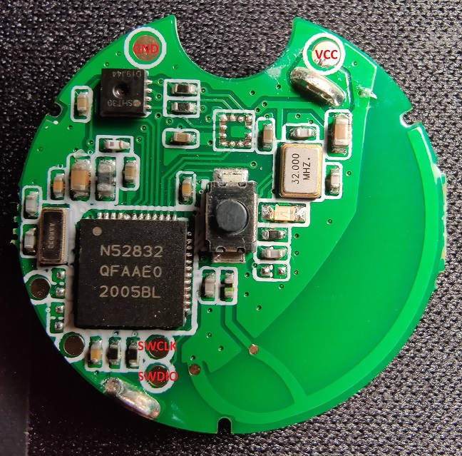

# NRF52832 SHT30 Sensor Beacon
This is a custom firmware for NRF52 based BLE tags with an SHT30 temperature/humidity sensor that can be found on AliExpress and similar stores.



## Features
 * Broadcasts current temperature, humidity and battery voltage as BLE advertisements (as manufacturer specific data)
 * Arbitrary long broadcast intervals (exceeding BLE spec of 10.24sec)
 * Receiver application and InfluxDB data collector for Linux

## Requirements
 * NRF SDK 17.0.2
 * ARM GNU Embedded Toolchain (`gcc-arm-none-eabi-9-2020-q2-update`)
 * CMake 
 * Docker (receiver only)
 * SEGGER J-Link
 * nRFgo Studio or nrfjprog

## Note on CMake support
CMake scripts are based on [cmake-nRF5x](https://github.com/Polidea/cmake-nRF5x) with some hacks to support SDK 17.0.2.

## Project Structure
 * [/application](application/) - NRF52 firmware
 * [/collector](collector/) - BLE receiver application for Linux (data logged to console and forwarded to InfluxDB)

## Setup

### NRF52 SoftDevice
Install S132 (`nRF5_SDK_17.0.2/components/softdevice/s132/hex/s132_nrf52_7.2.0_softdevice.hex`) using nRFgo Studio or nrfjprog.

### Application
```
cd application
cmake -S . -B build -DCMAKE_BUILD_TYPE=MinSizeRel -DCMAKE_TOOLCHAIN_FILE=../cmake/arm-none-eabi.cmake -DTOOLCHAIN_PREFIX=${PATH_TO_ARM_TOOLCHAIN} -DNRF5_SDK_PATH=${PATH_TO_NRF_SDK}
cmake --build build --target hex
```
Flash `application/build/nrf52_sh30_application.hex` as application using nRFgo Studio or nrfjprog. 

### Collector
Build & run docker container:
```
cd collector/
docker build -t nrf52-collector .
docker run --name=nrf52-collector -d -it --restart=always --net=host --privileged nrf52-collector
```

The bluetooth device is hardcoded as `hci0`. `--net=host --privileged` is needed to access the bluetooth device from inside the Docker container.


## Behavior & Protocol
In a fixed interval (default 10 minutes) the application reads temperature & humidity values from the SHT30 sensor and the current battery voltage via the internal ADC.
The collected data is then sent as a BLE advertisement message using the manufacturer specific payload type. The transmission is repeated three times in 25ms intervals. 
After that, the application enters power saving mode (System ON low power mode) until the next interval.

The manufacturer specific data in the BLE advertisement messages is sent with a company identifier of `0xFFFF`. The payload data consists of 11 bytes:
```C
struct sensor_data_t {
    uint16_t msg_id;                // Incrementing message ID (to detect lost messages and filter duplicates)
    int32_t temperature;            // Temperature in 0.001°C units
    int32_t humidity;               // Relative humidity in 0.001% units
    uint16_t battery_voltage;       // Battery voltage in mV
    uint8_t battery_percentage;     // Estimated battery level in % (based on battery_level_in_percent() in NRF SDK)
};
```

## Range
At least ~10m through concrete walls & windows. Tested using a BLE receiver with a good external antenna (LM1010 Bluetooth USB Adapter) in a very noisy 2.4GHz environment (~15 WiFi APs in range). Occasionally the messages from one transmission interval are lost. (but very rarely more than once in a row)

## Battery Life
The sensor beacons will last for about 4-5 months on a single CR2032 cell (with 10 minutes transmission interval).
CR2032 are quite sensitive to temperature, so this time will be less in cold environments.
As an alternative, 2x AA/AAA batteries can be soldered directly to the GND/VCC pins for a much longer lifetime.